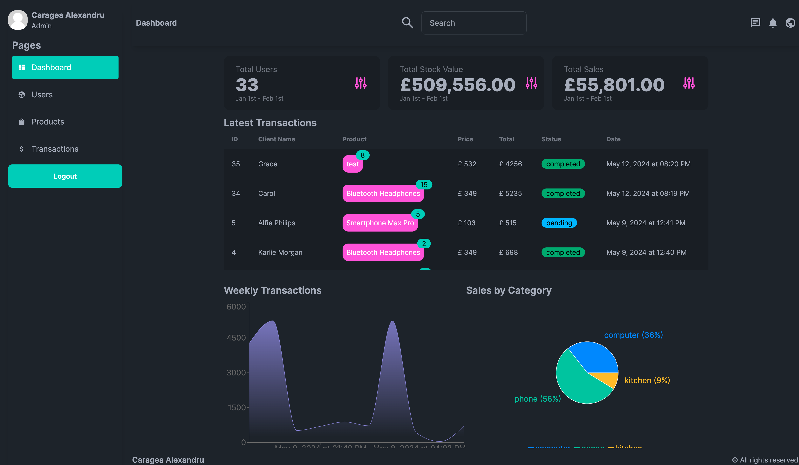
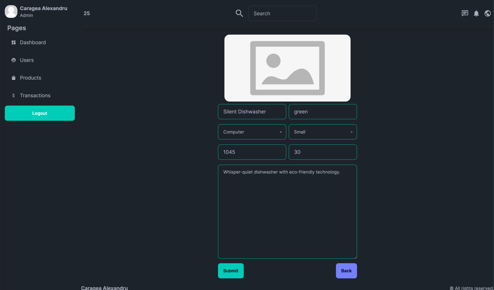

# Dashboard Application

## Overview

This is a web application built using Next.js, Supabase, Daisy UI, and Recharts. The application provides a dashboard
interface for managing users, products, and transactions with various features including authentication, protected
routes, data visualization, and more.

## Features

### Authentication

- **Server-side authentication** using Supabase.
- **Protected routes** ensuring only authenticated users can access certain pages.

### Data Management

- **Card Data**: Displays total users, total stock value (based on all items in stock), and total sales (representing
  all completed transactions).

### Transactions

- **Latest Transactions**: Table showing the last 10 transactions.
- **Weekly Transactions**: Line chart displaying the value of the last 10 transactions.
- **Sales by Category**: Chart showing the amount sold in each category.
- **Transaction Table**: Displays transactions based on client ID and product ID, showing item quantity, price, and
  total amount.

### Users

- **User Search**: Server-side filtering of users using URL parameters for easy sharing.
- **User Table**: View and delete users with pagination support.
- **Invite User**: Functionality to invite new users to the platform.

### Products

- **Product Management**: Insert, view, and delete products with client-side validation.
- **Product Table**: Displays all products with details like title, description, price, stock, size, color, and creation
  date. Includes actions to view or delete products.

## Tech Stack

- **Next.js**:
- **Supabase**:
- **Daisy UI**:
- **Recharts**:
- **Zod**:

## Usage

### Dashboard

- View total users, total stock value, and total sales.
- Check the latest transactions and weekly transaction values.
- See sales data categorized by product categories.

### Users

- Search for users and share filtered results using URL parameters.
- View, delete, and manage users with pagination.

### Products

- Add new products with client-side validation.
- View and delete products from the product table.

### Transactions

- View detailed transaction data including item quantities, prices, and total amounts.

## Contributing

Contributions are welcome! Please open an issue or submit a pull request for any improvements or bug fixes.

## License

This project is licensed under the MIT License. See the [LICENSE](LICENSE) file for more information.
